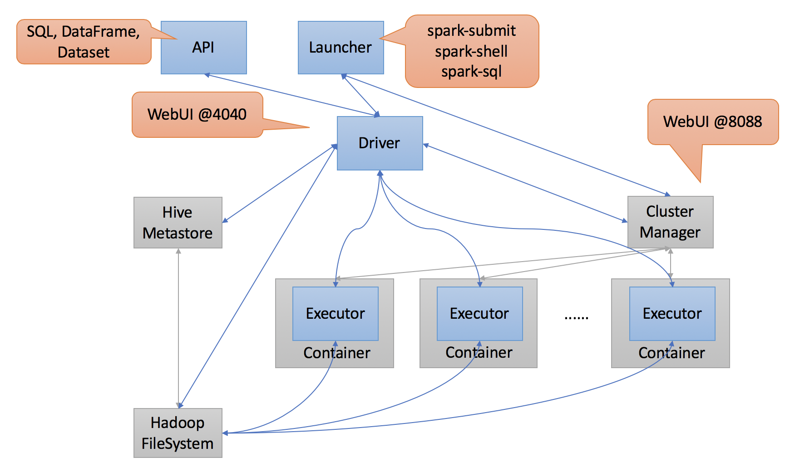

# Spark Architecture

## Overview
Architectural design principles, patterns and best practices to tackle
complexity of such a sophisticated distributed system.

* Performance and scalability
* Fault tolerance (high availability and resilience)
* Security
* Evolution
* Usability
* Design patterns

## Components

2 level scheduling:

* Cluster Manager: cluster level, inter-application
* Driver: application level, intra-application