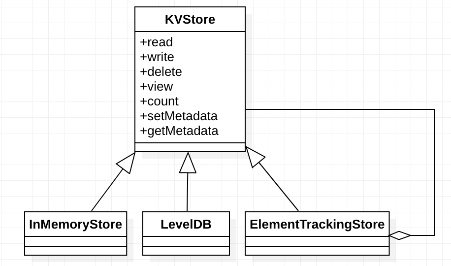

# KV Store

## Overview

## Design and Implementation

**`KVStore`**

`KVStore` is abstraction for a local key/value store for storing app data.

There are two main features provided by the implementations of this interface:

* Serialization

If the underlying data store requires serialization, data will be serialized to and deserialized
using a KVStoreSerializer, which can be customized by the application. The serializer is based on
Jackson, so it supports all the Jackson annotations for controlling the serialization of app-defined
types. Data is also automatically compressed to save disk space.

* Automatic Key Management

When using the built-in key management, the implementation will automatically create unique keys for
each type written to the store. Keys are based on the type name, and always start with the "+"
prefix character (so that it's easy to use both manual and automatic key management APIs without
conflicts).

Another feature of automatic key management is indexing; by annotating fields or methods of objects
written to the store with KVIndex, indices are created to sort the data by the values of those
properties. This makes it possible to provide sorting without having to load all instances of those
types from the store.

KVStore instances are thread-safe for both reads and writes.

**`ElementTrackingStore`**

`ElementTrackingStore` is a KVStore wrapper that allows tracking the number of elements of specific
types, and triggering actions once they reach a threshold. This allows writers, for example, to
control how much data is stored by potentially deleting old data as new data is added. This store is
used when populating data either from a live UI or an event log.
