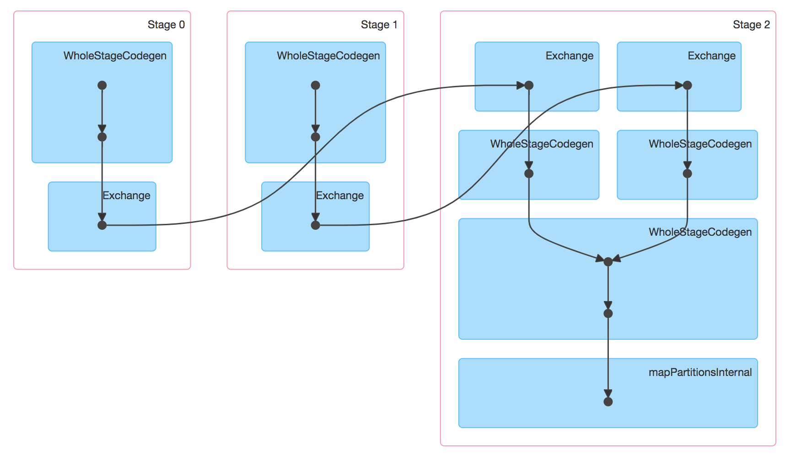
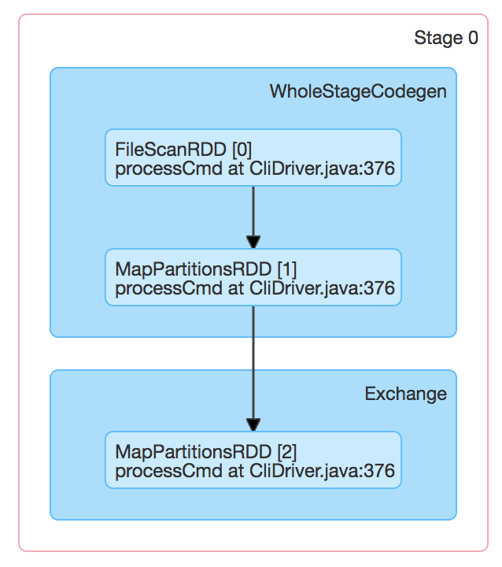
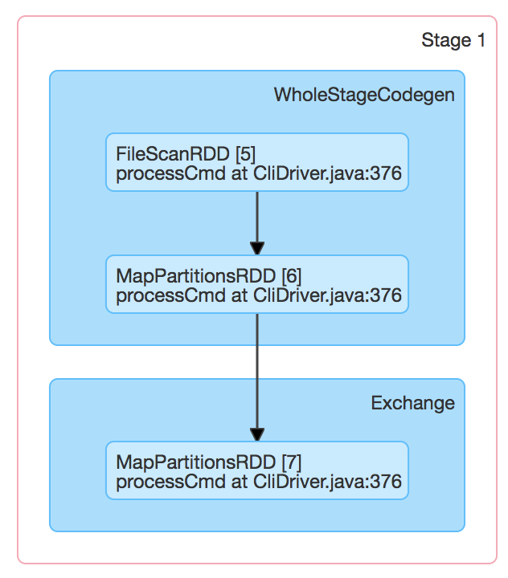

## Overview


## Design and Implementation

### Design


### Source code Guide
core/src/main/resources/org/apache/spark/ui/static/


### DAG:

```
spark-dag-viz.js
spark-dag-viz.css
```

spark-sql-viz uses:

* graphlib-dot.min.js: data structures and algorithms for parsing dot file
* dagre-d3: layout
* d3: rendering

## Case Study

### job dag viz



```
<div>
  <!-- job-dag-viz -->
  <span id="job-dag-viz" class="expand-dag-viz" onclick="toggleDagViz(true);">
    <span class="expand-dag-viz-arrow arrow-closed"></span>
    <a data-toggle="tooltip" title="Shows a graph of stages executed for this job, each of which can contain
   multiple RDD operations (e.g. map() and filter()), and of RDDs inside each operation
   (shown as dots)." data-placement="right">
      DAG Visualization
    </a>
  </span>

  <!-- dag-viz-graph -->
  <div id="dag-viz-graph"></div>

  <!-- dag-viz-metadata -->
  <div id="dag-viz-metadata" style="display:none">
    <!-- stage-metadata-0 -->
    <div class="stage-metadata" stage-id="0" skipped="false">
      <div class="dot-file">digraph G {
  subgraph clusterstage_0 {
    label=&quot;Stage 0&quot;;
    subgraph cluster7 {
      label=&quot;WholeStageCodegen&quot;;
      0 [label=&quot;FileScanRDD [0]\nprocessCmd at CliDriver.java:376&quot;];
      1 [label=&quot;MapPartitionsRDD [1]\nprocessCmd at CliDriver.java:376&quot;];
    }
    subgraph cluster6 {
      label=&quot;Exchange&quot;;
      2 [label=&quot;MapPartitionsRDD [2]\nprocessCmd at CliDriver.java:376&quot;];
    }
  }
  0-&gt;1;
  1-&gt;2;
}</div></div>
    <!-- stage-metadata-1 -->
    <div class="stage-metadata" stage-id="1" skipped="false">
      <div class="dot-file">digraph G {
  subgraph clusterstage_1 {
    label=&quot;Stage 1&quot;;
    subgraph cluster16 {
      label=&quot;WholeStageCodegen&quot;;
      5 [label=&quot;FileScanRDD [5]\nprocessCmd at CliDriver.java:376&quot;];
      6 [label=&quot;MapPartitionsRDD [6]\nprocessCmd at CliDriver.java:376&quot;];
    }
    subgraph cluster15 {
      label=&quot;Exchange&quot;;
      7 [label=&quot;MapPartitionsRDD [7]\nprocessCmd at CliDriver.java:376&quot;];
    }
  }
  5-&gt;6;
  6-&gt;7;
}</div></div>
    <!-- stage-metadata-2 -->
    <div class="stage-metadata" stage-id="2" skipped="false">
      <div class="dot-file">digraph G {
  subgraph clusterstage_2 {
    label=&quot;Stage 2&quot;;
    subgraph cluster6 {
      label=&quot;Exchange&quot;;
      3 [label=&quot;ShuffledRowRDD [3]\nprocessCmd at CliDriver.java:376&quot;];
    }
    subgraph cluster3 {
      label=&quot;WholeStageCodegen&quot;;
      4 [label=&quot;MapPartitionsRDD [4]\nprocessCmd at CliDriver.java:376&quot;];
    }
    subgraph cluster15 {
      label=&quot;Exchange&quot;;
      8 [label=&quot;ShuffledRowRDD [8]\nprocessCmd at CliDriver.java:376&quot;];
    }
    subgraph cluster12 {
      label=&quot;WholeStageCodegen&quot;;
      9 [label=&quot;MapPartitionsRDD [9]\nprocessCmd at CliDriver.java:376&quot;];
    }
    subgraph cluster0 {
      label=&quot;WholeStageCodegen&quot;;
      10 [label=&quot;ZippedPartitionsRDD2 [10]\nprocessCmd at CliDriver.java:376&quot;];
      11 [label=&quot;MapPartitionsRDD [11]\nprocessCmd at CliDriver.java:376&quot;];
    }
    subgraph cluster20 {
      label=&quot;mapPartitionsInternal&quot;;
      12 [label=&quot;MapPartitionsRDD [12]\nprocessCmd at CliDriver.java:376&quot;];
    }
  }
  3-&gt;4;
  8-&gt;9;
  4-&gt;10;
  9-&gt;10;
  10-&gt;11;
  11-&gt;12;
}</div>
<div class="incoming-edge">2,3</div><div class="incoming-edge">7,8</div>
</div>
  </div><!-- dag-viz-metadata -->

</div>
```

### stage DAG viz






```
<div>
  <span id="stage-dag-viz" class="expand-dag-viz" onclick="toggleDagViz(false);">
    <span class="expand-dag-viz-arrow arrow-closed"></span>
    <a data-toggle="tooltip" title="Shows a graph of RDD operations in this stage, and RDDs inside each one. A stage can run
   multiple operations (e.g. two map() functions) if they can be pipelined. Some operations
   also create multiple RDDs internally. Cached RDDs are shown in green.
" data-placement="right">
      DAG Visualization
    </a>
  </span>

  <div id="dag-viz-graph"></div>

  <div id="dag-viz-metadata" style="display:none">

    <div class="stage-metadata" stage-id="2" skipped="false">
      <div class="dot-file">digraph G {
  subgraph clusterstage_2 {
    label=&quot;Stage 2&quot;;
    subgraph cluster6 {
      label=&quot;Exchange&quot;;
      3 [label=&quot;ShuffledRowRDD [3]\nprocessCmd at CliDriver.java:376&quot;];
    }
    subgraph cluster3 {
      label=&quot;WholeStageCodegen&quot;;
      4 [label=&quot;MapPartitionsRDD [4]\nprocessCmd at CliDriver.java:376&quot;];
    }
    subgraph cluster15 {
      label=&quot;Exchange&quot;;
      8 [label=&quot;ShuffledRowRDD [8]\nprocessCmd at CliDriver.java:376&quot;];
    }
    subgraph cluster12 {
      label=&quot;WholeStageCodegen&quot;;
      9 [label=&quot;MapPartitionsRDD [9]\nprocessCmd at CliDriver.java:376&quot;];
    }
    subgraph cluster0 {
      label=&quot;WholeStageCodegen&quot;;
      10 [label=&quot;ZippedPartitionsRDD2 [10]\nprocessCmd at CliDriver.java:376&quot;];
      11 [label=&quot;MapPartitionsRDD [11]\nprocessCmd at CliDriver.java:376&quot;];
    }
    subgraph cluster20 {
      label=&quot;mapPartitionsInternal&quot;;
      12 [label=&quot;MapPartitionsRDD [12]\nprocessCmd at CliDriver.java:376&quot;];
    }
  }
  3-&gt;4;
  8-&gt;9;
  4-&gt;10;
  9-&gt;10;
  10-&gt;11;
  11-&gt;12;
}</div>
      <div class="incoming-edge">2,3</div><div class="incoming-edge">7,8</div>
    </div>
  </div>

</div>
```


