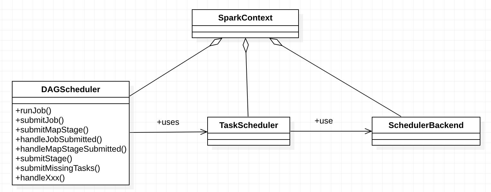

# Scheduler

## Overview

## Design and Implementation

### Scheduler overview

`DAGScheduler`, `TaskScheduler` and `SchedulerBackend`:

The interaction when an RDD action is invoked:

### DAGScheduler

### TaskScheduler and SchedulerBackend

## Evolution

