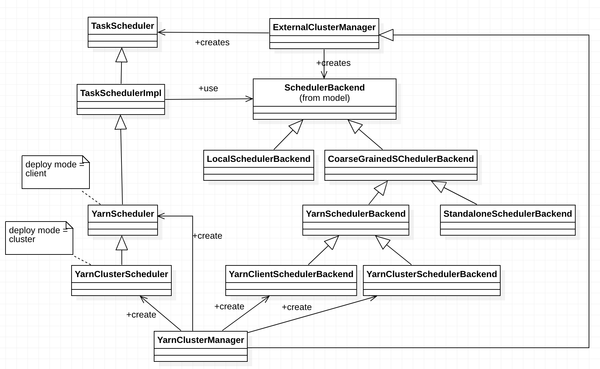

# Scheduler

## Overview

## Design and Implementation

### RDD
`RDD`:

`Partition`:

`Dependency`:

`Partitioner`:

### Scheduler overview

`DAGScheduler`, `TaskScheduler` and `SchedulerBackend`:

The interaction when an RDD action is invoked:

### DAGScheduler

### TaskScheduler and SchedulerBackend

## Evolution

## References

* https://en.wikipedia.org/wiki/Event_loop
