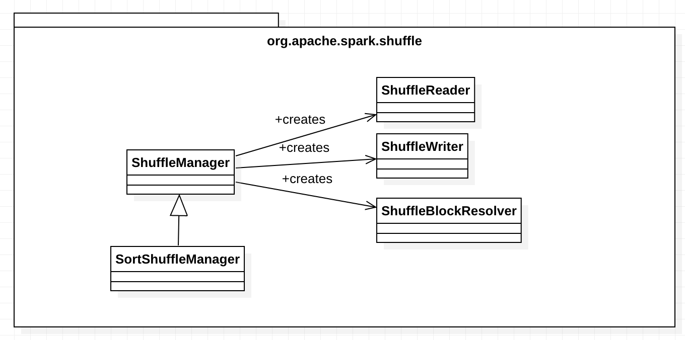
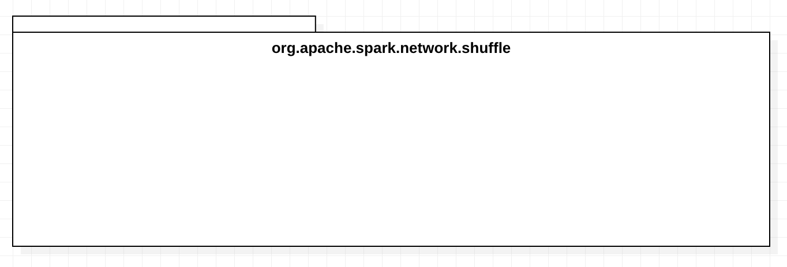
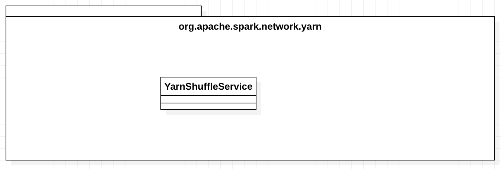

# Shuffle

## Overview

## Design and Implementation

## FAQ

org.apache.spark.shuffle.FetchFailedException: failed to allocate  byte(s) of direct memory (used: , max: )

* https://issues.apache.org/jira/browse/SPARK-22458
* https://github.com/netty/netty/issues/6221
* https://dzone.com/articles/default-hotspot-maximum-direct-memory-size
* https://stackoverflow.com/questions/42651707/how-to-find-a-root-cause-of-the-following-netty-error-io-netty-util-internal-ou
* http://netty.io/wiki/reference-counted-objects.html
* https://netty.io/4.0/xref/io/netty/util/internal/PlatformDependent.html

## References

* SOS: Optimizing Shuffle I/O. https://databricks.com/session/sos-optimizing-shuffle-i-o