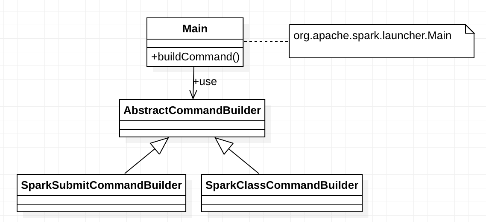
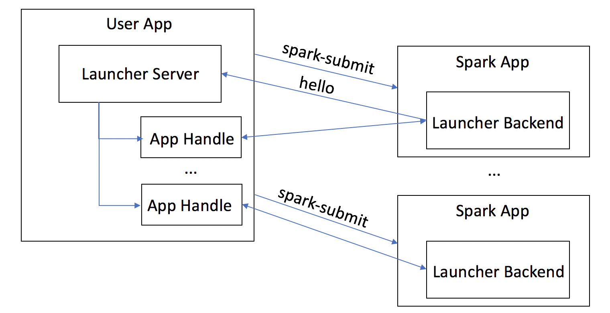
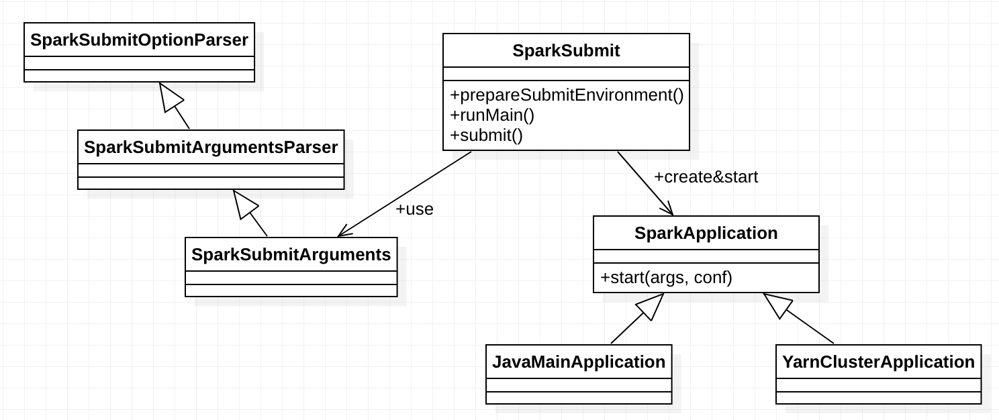

# Launcher

## Overview
* Launch an interactive shell
* Launch a batch application
* Launch an app programmatically
* command line parser

packages:

* org.apache.spark.launcher

Modules:

* spark-core
* spark-launcher


## Launch an interactive shell

### `spark-shell`
`spark-shell` calls `spark-submit`, which in turn calls `spark-class`.

`bin/spark-shell`

```
function main() {
  if $cygwin; then
    ...
  else
    export SPARK_SUBMIT_OPTS
    "${SPARK_HOME}"/bin/spark-submit --class org.apache.spark.repl.Main --name "Spark shell" "$@"
  fi
}
```

`bin/spark-submit`

```
exec "${SPARK_HOME}"/bin/spark-class org.apache.spark.deploy.SparkSubmit "$@"
```

For a simple spark-shell command:

```
spark-shell --name my-spark-shell --master yarn --conf spark.driver.memory=512m
```

The above command results in calling the following commands subsequently.

```
/Users/cmao/Workspace/deploy/spark/bin/spark-submit
--class org.apache.spark.repl.Main 
--name Spark shell
--name my-spark-shell
--master yarn
--conf spark.driver.memory=512m
```

```
/Users/cmao/Workspace/deploy/spark/bin/spark-class org.apache.spark.deploy.SparkSubmit 
--class org.apache.spark.repl.Main
--name Spark shell
--name my-spark-shell
--master yarn 
--conf spark.driver.memory=512m
```

`spark-class` generates the final java command using `org.apache.spark.launcher.Main`.

`bin/spark-class`

```
build_command() {
  "$RUNNER" -Xmx128m -cp "$LAUNCH_CLASSPATH" org.apache.spark.launcher.Main "$@"
  printf "%d\0" $?
}
```



`org.apache.spark.launcher.Main` is Command line interface for the Spark launcher. Used internally by Spark scripts. Its usage:

> Usage: Main [class] [class args]
>
> This CLI works in two different modes:
>
> * "spark-submit": if class is "org.apache.spark.deploy.SparkSubmit", the SparkLauncher (SparkSubmit?) class is used to launch a Spark application.
> * "spark-class": if another class is provided, an internal Spark class is run.
>
> This class works in tandem with the "bin/spark-class" script on Unix-like systems, and "bin/spark-class2.cmd" batch script on Windows to execute the final command.
On Unix-like systems, the output is a list of command arguments, separated by the NULL character. On Windows, the output is a command line suitable for direct execution from the script.

```
/Library/Java/JavaVirtualMachines/jdk1.8.0_131.jdk/Contents/Home/bin/java
-cp /Users/cmao/Workspace/deploy/spark-conf/:/Users/cmao/Workspace/deploy/spark/jars/*:/Users/cmao/Workspace/dataplatform/deploy/hadoop-conf:/Users/cmao/Workspace/deploy/hadoop-conf/:/Users/cmao/Workspace/deploy/hadoop-2.7.3/share/hadoop/common/lib/*:/Users/cmao/Workspace/deploy/hadoop-2.7.3/share/hadoop/common/*:/Users/cmao/Workspace/deploy/hadoop-2.7.3/share/hadoop/hdfs/:/Users/cmao/Workspace/deploy/hadoop-2.7.3/share/hadoop/hdfs/lib/*:/Users/cmao/Workspace/deploy/hadoop-2.7.3/share/hadoop/hdfs/*:/Users/cmao/Workspace/deploy/hadoop-2.7.3/share/hadoop/yarn/lib/*:/Users/cmao/Workspace/deploy/hadoop-2.7.3/share/hadoop/yarn/*:/Users/cmao/Workspace/deploy/hadoop-2.7.3/share/hadoop/mapreduce/lib/*:/Users/cmao/Workspace/deploy/hadoop-2.7.3/share/hadoop/mapreduce/*:/Users/cmao/Workspace/deploy/hadoop/contrib/capacity-scheduler/*.jar:/Users/cmao/Workspace/deploy/hive-conf/ 
-Dscala.usejavacp=true
-Xmx512m
org.apache.spark.deploy.SparkSubmit
--master yarn
--conf spark.driver.memory=512m
--class org.apache.spark.repl.Main
--name Spark shell
--name my-spark-shell
spark-shell
```

Finally, `org.apache.spark.deploy.SparkSubmit` is launched by java.

`SparkSubmit` is the main gateway of launching a Spark application, which uses
`org.apache.spark.deploy.SparkSubmitArguments` to parse and encapsulate arguments from the
spark-submit script. The first unrecognized option is treated as the "primary resource". Everything
else is treated as application arguments. `spark-shell` is one of special primary resources. Other
special primary resources are `pyspark-shell`, `sparkr-shell`, and etc, which represent shells
rather than application jars.

### `spark-sql`

```
spark-sql --conf spark.sql.autoBroadcastJoinThreshold=-1 --conf spark.sql.codegen.wholeStage=false
```

```
/Users/cmao/Workspace/deploy/spark/bin/spark-class org.apache.spark.deploy.SparkSubmit
--class org.apache.spark.sql.hive.thriftserver.SparkSQLCLIDriver
--conf spark.sql.autoBroadcastJoinThreshold=-1
--conf spark.sql.codegen.wholeStage=false
```

```
/Library/Java/JavaVirtualMachines/jdk1.8.0_131.jdk/Contents/Home/bin/java
-cp /Users/cmao/Workspace/deploy/spark-conf/:/Users/cmao/Workspace/deploy/spark/jars/*:/Users/cmao/Workspace/dataplatform/deploy/hadoop-conf:/Users/cmao/Workspace/deploy/hadoop-conf/:/Users/cmao/Workspace/deploy/hadoop-2.7.3/share/hadoop/common/lib/*:/Users/cmao/Workspace/deploy/hadoop-2.7.3/share/hadoop/common/*:/Users/cmao/Workspace/deploy/hadoop-2.7.3/share/hadoop/hdfs/:/Users/cmao/Workspace/deploy/hadoop-2.7.3/share/hadoop/hdfs/lib/*:/Users/cmao/Workspace/deploy/hadoop-2.7.3/share/hadoop/hdfs/*:/Users/cmao/Workspace/deploy/hadoop-2.7.3/share/hadoop/yarn/lib/*:/Users/cmao/Workspace/deploy/hadoop-2.7.3/share/hadoop/yarn/*:/Users/cmao/Workspace/deploy/hadoop-2.7.3/share/hadoop/mapreduce/lib/*:/Users/cmao/Workspace/deploy/hadoop-2.7.3/share/hadoop/mapreduce/*:/Users/cmao/Workspace/deploy/hadoop/contrib/capacity-scheduler/*.jar:/Users/cmao/Workspace/deploy/hive-conf/
-Xmx1g
org.apache.spark.deploy.SparkSubmit
--conf spark.sql.codegen.wholeStage=false
--conf spark.sql.autoBroadcastJoinThreshold=-1
--class org.apache.spark.sql.hive.thriftserver.SparkSQLCLIDriver
spark-internal
```

## Launch a batch application

```
spark-submit
--name "ddis.simpleapp.SimpleApp (with handle)"
--master yarn
--conf spark.driver.memory=512m 
target/simpleapp-0.1.0-jar-with-dependencies.jar
README.md
```

```
/Users/cmao/Workspace/deploy/spark/bin/spark-class
org.apache.spark.deploy.SparkSubmit
--name ddis.simpleapp.SimpleApp (with handle) 
--master yarn
--conf spark.driver.memory=512m
target/simpleapp-0.1.0-jar-with-dependencies.jar
README.md
```

```
/Library/Java/JavaVirtualMachines/jdk1.8.0_131.jdk/Contents/Home/bin/java 
-cp /Users/cmao/Workspace/deploy/spark-conf/:/Users/cmao/Workspace/deploy/spark/jars/*:/Users/cmao/Workspace/dataplatform/deploy/hadoop-conf:/Users/cmao/Workspace/deploy/hadoop-conf/:/Users/cmao/Workspace/deploy/hadoop-2.7.3/share/hadoop/common/lib/*:/Users/cmao/Workspace/deploy/hadoop-2.7.3/share/hadoop/common/*:/Users/cmao/Workspace/deploy/hadoop-2.7.3/share/hadoop/hdfs/:/Users/cmao/Workspace/deploy/hadoop-2.7.3/share/hadoop/hdfs/lib/*:/Users/cmao/Workspace/deploy/hadoop-2.7.3/share/hadoop/hdfs/*:/Users/cmao/Workspace/deploy/hadoop-2.7.3/share/hadoop/yarn/lib/*:/Users/cmao/Workspace/deploy/hadoop-2.7.3/share/hadoop/yarn/*:/Users/cmao/Workspace/deploy/hadoop-2.7.3/share/hadoop/mapreduce/lib/*:/Users/cmao/Workspace/deploy/hadoop-2.7.3/share/hadoop/mapreduce/*:/Users/cmao/Workspace/deploy/hadoop/contrib/capacity-scheduler/*.jar:/Users/cmao/Workspace/deploy/hive-conf/ 
-Xmx512m org.apache.spark.deploy.SparkSubmit
--master yarn
--conf spark.driver.memory=512m 
--name ddis.simpleapp.SimpleApp (with handle)
target/simpleapp-0.1.0-jar-with-dependencies.jar
README.md
```

## Launch an application programmatically
`AbstractLauncher`


`LauncherServer`



## `SparkSubmit`
No matter what type a spark application we launch, we finally use `SparkSubmit` to submit the
application.




`SparkSubmit.submit()`: Submit the application using the provided parameters. This runs in two steps.

1. First, we prepare the launch environment by setting up the appropriate classpath, system
   properties, and application arguments for running the child main class based on the cluster 
   manager and the deploy mode.
2. Second, we use this launch environment to invoke the main method of the child main class.

Arguments are parsed and encapsulated by `SparkSubmitArguments`.

`SparkApplication`: Entry point for a Spark application.

* In client mode, launch the application main class directly. `JavaMainApplication` is created. It
  wraps a standard Java class with a "main" method, e.g. `org.apache.spark.repl.Main`, 
  `org.apache.spark.sql.hive.thriftserver.SparkSQLCLIDriver`.
* In yarn-cluster mode, `org.apache.spark.deploy.yarn.YarnClusterApplication` is created. It uses
  `org.apache.spark.deploy.yarn.Client` to wrap the user class.
* `ClientApp` is used by standalone cluster.
* `RestSubmissionClientApp`. It uses `RestSubmissionClient`. This is supported by standalone and 
  Mesos.
  
### Command Line Parser

**SparkSubmitOptionParser**

Parser for spark-submit command line options. This class encapsulates the parsing code for 
spark-submit command line options, so that there is a single list of options that needs to be
maintained (well, sort of, but it makes it harder to break things).

**SparkSubmitArgumentsParser**

`SparkSubmitArgumentsParser` = `SparkSubmitOptionParser`

This class makes `SparkSubmitOptionParser` visible for Spark code outside of the `launcher` package, 
since Java doesn't have a feature similar to `private[spark]`, and we don't want that class to be 
public.

```
private[spark] abstract class SparkSubmitArgumentsParser extends SparkSubmitOptionParser
```

**SparkSubmitArguments**

Parses and encapsulates arguments from the spark-submit script.

