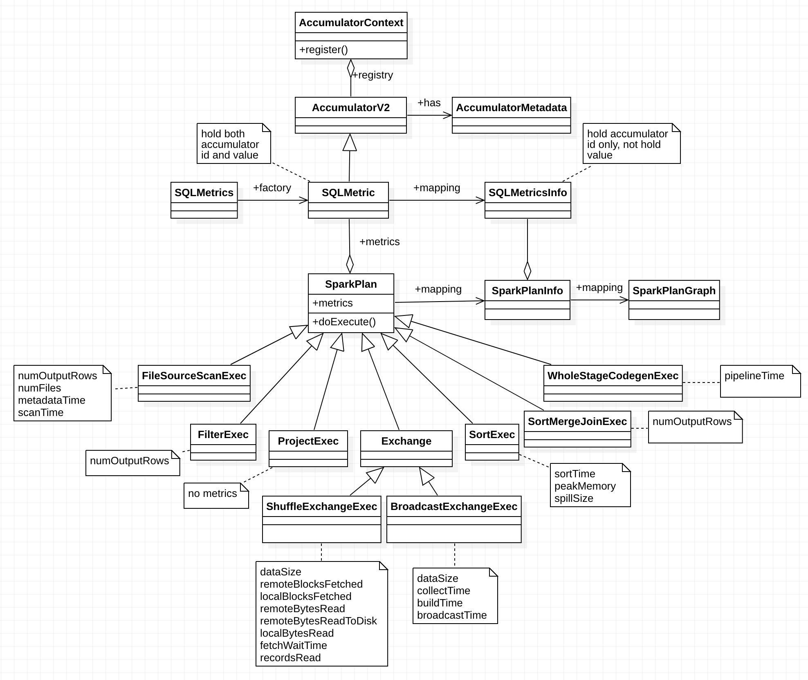

# SQL Metrics

## Overview

## Design and Implementation

### SQL Metrics
SQL metrics classes relationship:

`SQLMetric` is a metric used in a SQL query plan. This is implemented as an `AccumulatorV2`. Updates
on the executor side are automatically propagated and shown in the SQL UI through metrics. Updates
on the driver side must be explicitly posted using `SQLMetrics.postDriverMetricUpdates()`.

`SQLMetric` is kind of `AccumulatorV2`, which holds `AccumulatorMetadata` including `id`, `name` and
etc. `SQLMetrics` is the static factory to create `SQLMetric`. It deals with details of size and
timing metrics, e.g. total, min, median, max.

Physical operators (`SparkPlan`) hold metrics of type `SQLMetric`. Different operators have
different collection of metrics. Some operators even have no metrics at all, e.g. `ProjectExec`.
Physical operator metrics are updated during its execution within `doExecute` method.

When `SparkPlan` is mapped to `SparkPlanInfo`, which is further mapped to `SparkPlanGraph`,
`SQLMetric` is mapped to `SQLMetricInfo`, which holds accumulator id.

## Evolution

* [SPARK-26221 Improve Spark SQL instrumentation and metrics](https://issues.apache.org/jira/browse/SPARK-26221)

## Coding

* SQLMetricsSuite
* SQLListenerSuite
