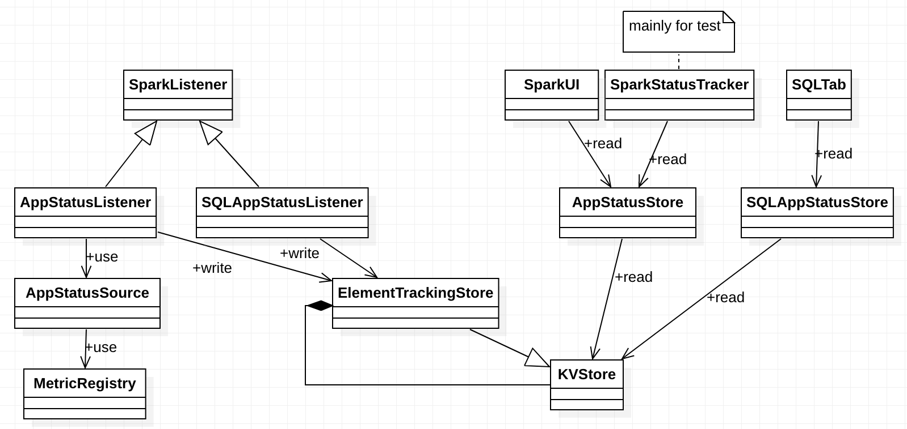
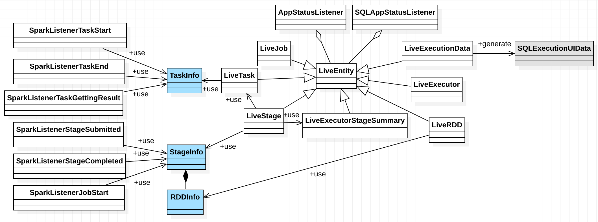
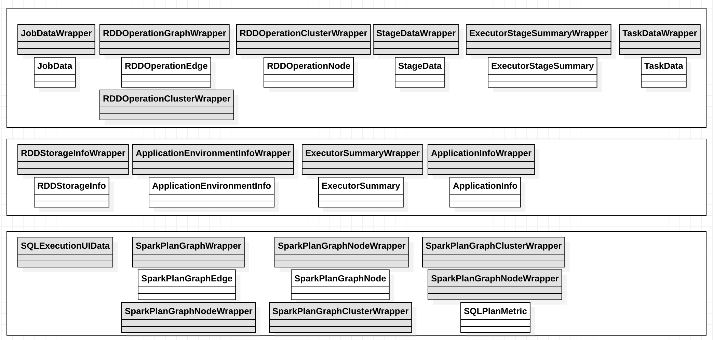
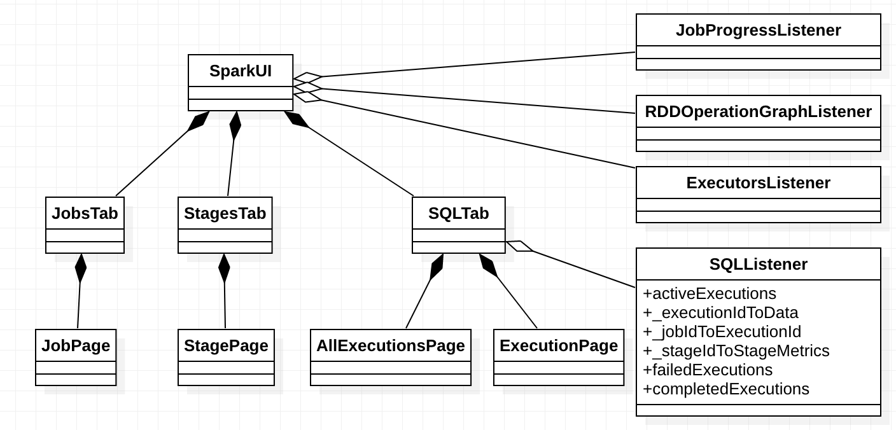

# App State Management

## Overview

## Design and Implementation

### State overview

Spark tracks app status using `AppStatusListener` and tracks SQL app status using
`SQLAppStatusListener`. These listeners write status finally into `KVStore`. On the other hand,
`AppStatusStore` and `SQLAppStatusStore` query `KVStore` to get app status.

### Spark Listener Types and Live Entities

SparkListener types are used to pass information from the scheduler to SparkListeners.

* `StageInfo` stores information about a stage to pass from the scheduler to SparkListeners.
* `TaskInfo` stores information about a running task attempt inside a TaskSet. This also used to
  pass from scheduler to SparkListeners.
* `RDDInfo`

see `org/apache/spark/scheduler/SparkListener.scala` for more details.

Live entities are types used by `AppStatusListener` or `SQLAppStatusListener`. `LiveEntity` and its
subclasses are mutable representations of live entities in Spark (jobs, stages, tasks, et al). Every
live entity uses one of these instances to keep track of their evolving state, and periodically
flush an immutable view of the entity to the app state store.

Take task information for example, `TaskInfo` is passed from the scheduler to `AppStatusListener`
via `SparkListenerTaskStart` event. `AppStatusListener` handles this event by creating `LiveTask`
using `TaskInfo` and buffering it. The buffered `LiveTask`s will be flushed to `KVStore`
periodically. A `LiveTask` is converted to `TaskDataWrapper` before it is flushed to `KVStore`.

### Store Types and REST API/Web UI Types

When app status are written to `KVStore`, store types are used. Store types are usually suffixed
with `Wrapper`. Web UI or REST API use different types.

Task task information for example, `TaskData` is used by REST API.

## Evolution
In Spark 2.1, Spark stores app status using listeners themselves (`JobProgressListener`,
`RDDOperationGraphListener`, `ExecutorsListener`) instead of `AppStatusStore`. And Spark stores SQL
app status using `SQLListener` instead of `SQLAppStatusStore`.

## References

* https://martinfowler.com/eaaDev/EventSourcing.html

