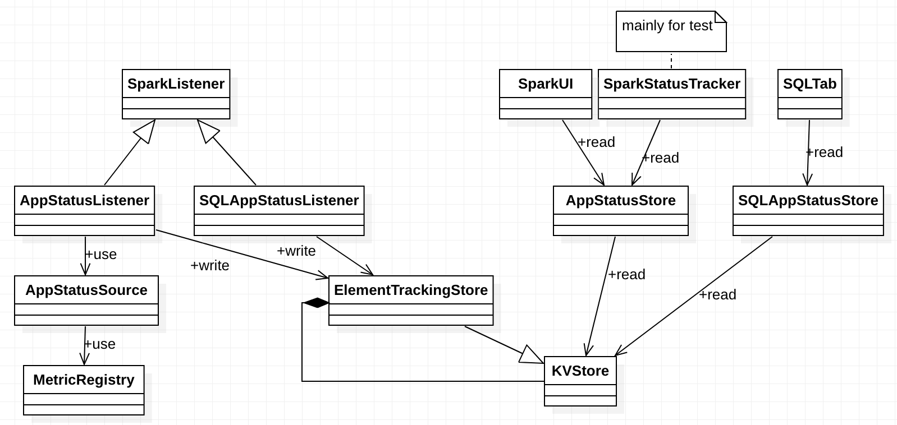
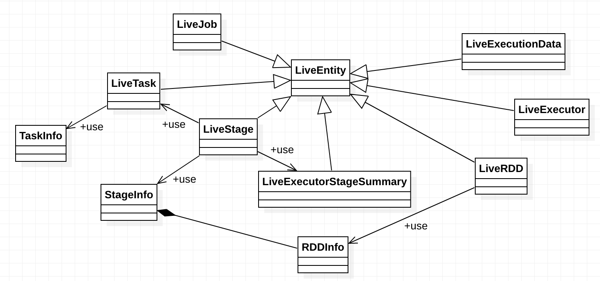

# App Status

## Overview

## Design and Implementation

### Status overview

Spark tracks app status using `AppStatusListener` and tracks SQL app status using
`SQLAppStatusListener`. These listeners write status finally into `KVStore`. On the other hand,
`AppStatusStore` and `SQLAppStatusStore` query `KVStore` to get app status.

### Live Entity

## Evolution
In Spark 2.1, Spark stores app status using listeners instead of `AppStatusStore`. And Spark tracks
SQL app status using `SQLListener` instead of `SQLAppStatusStore`.

