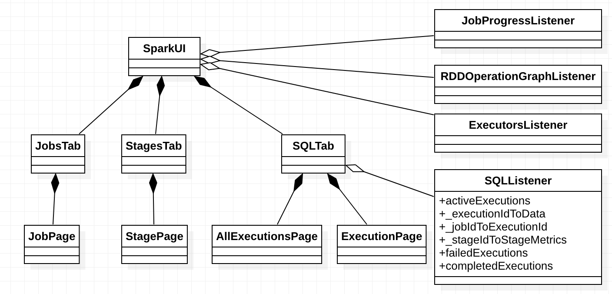

# App Status

## Overview

## Design and Implementation

Spark tracks app status using `AppStatusStore` and tracks SQL app status using `SQLAppStatusStore`.

## Evolution
In Spark 2.1, Spark stores app status using listeners instead of `AppStatusStore`. And Spark tracks
SQL app status using `SQLListener` instead of `SQLAppStatusStore`.

