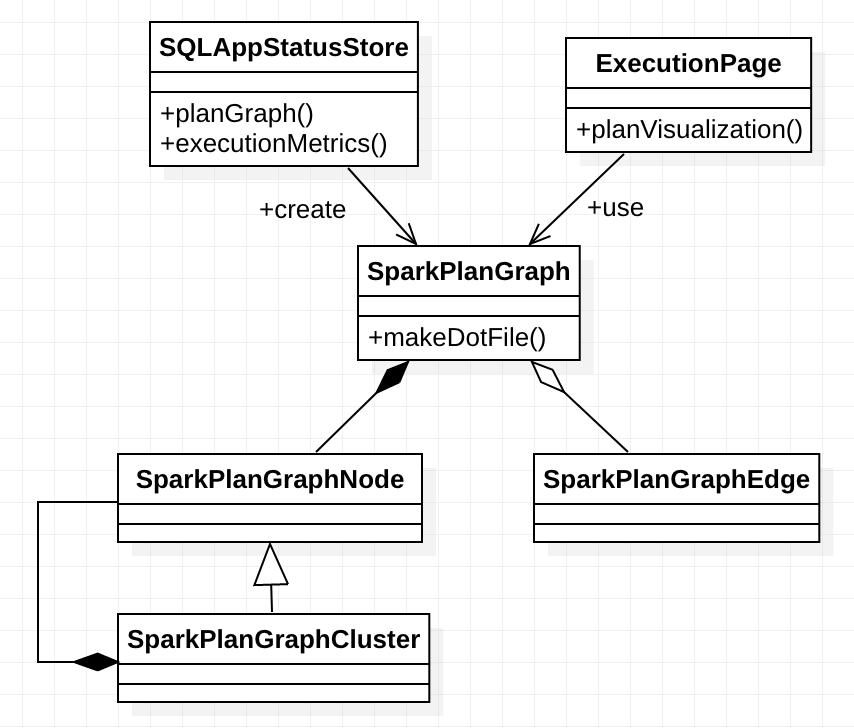

# SQL WebUI

## Overview


## Design and Implementation





## Evolution


## Case Study

### SQL DAG


```
<div>
  <div id="plan-viz-graph"></div>
  <div id="plan-viz-metadata" style="display:none">
    <div class="dot-file">
      digraph G {

  subgraph cluster0 {
    label=&quot;WholeStageCodegen\n\n\n177 ms (0 ms, 7 ms, 23 ms)&quot;;
      1 [label=&quot;SortMergeJoin\n \nnumber of output rows: 3&quot;];
  }
     

  subgraph cluster2 {
    label=&quot;WholeStageCodegen\n\n\n2.0 s (2 ms, 3 ms, 99 ms)&quot;;
      3 [label=&quot;Sort\n \nsort time total (min, med, max): \n0 ms (0 ms, 0 ms, 0 ms)\npeak memory total (min, med, max): \n16.5 MB (64.0 KB, 64.0 KB, 2.1 MB)\nspill size total (min, med, max): \n0.0 B (0.0 B, 0.0 B, 0.0 B)&quot;];
  }
     
  4 [label=&quot;Exchange\n \ndata size total (min, med, max): \n245.0 B (79.0 B, 79.0 B, 87.0 B)&quot;];

  subgraph cluster5 {
    label=&quot;WholeStageCodegen\n\n\n2.2 s (717 ms, 717 ms, 717 ms)&quot;;
      6 [label=&quot;Project&quot;];    
  7 [label=&quot;Filter\n \nnumber of output rows: 3&quot;];    
  8 [label=&quot;Scan parquet default.person\n \nnumber of output rows: 3\nnumber of files: 3\nmetadata time (ms): 3\nscan time total (min, med, max): \n0 ms (0 ms, 0 ms, 0 ms)&quot;];
  }
     

  subgraph cluster9 {
    label=&quot;WholeStageCodegen\n\n\n46 ms (23 ms, 23 ms, 23 ms)&quot;;
      10 [label=&quot;Sort\n \nsort time total (min, med, max): \n0 ms (0 ms, 0 ms, 0 ms)\npeak memory total (min, med, max): \n4.1 MB (2.1 MB, 2.1 MB, 2.1 MB)\nspill size total (min, med, max): \n0.0 B (0.0 B, 0.0 B, 0.0 B)&quot;];
  }
     
  11 [label=&quot;Exchange\n \ndata size total (min, med, max): \n229.0 B (71.0 B, 71.0 B, 87.0 B)&quot;];

  subgraph cluster12 {
    label=&quot;WholeStageCodegen\n\n\n2.2 s (718 ms, 718 ms, 718 ms)&quot;;
      13 [label=&quot;Project&quot;];    
  14 [label=&quot;Filter\n \nnumber of output rows: 3&quot;];    
  15 [label=&quot;Scan parquet default.graduate_program\n \nnumber of output rows: 3\nnumber of files: 3\nmetadata time (ms): 0\nscan time total (min, med, max): \n1.9 s (626 ms, 626 ms, 626 ms)&quot;];
  }
     
  3-&gt;1;

  4-&gt;3;

  6-&gt;4;

  7-&gt;6;

  8-&gt;7;

  10-&gt;1;

  11-&gt;10;

  13-&gt;11;

  14-&gt;13;

  15-&gt;14;

}
    </div>

    <div id="plan-viz-metadata-size">16</div>
    
    <div id="plan-meta-data-1">SortMergeJoin [graduate_program#2], [id#4], Inner</div>
    <div id="plan-meta-data-0">WholeStageCodegen</div>
    <div id="plan-meta-data-3">Sort [graduate_program#2 ASC NULLS FIRST], false, 0</div>
    <div id="plan-meta-data-2">WholeStageCodegen</div>
    <div id="plan-meta-data-4">Exchange hashpartitioning(graduate_program#2, 200)</div>
    <div id="plan-meta-data-6">Project [id#0, name#1, graduate_program#2, spark_status#3]</div>
    <div id="plan-meta-data-7">Filter isnotnull(graduate_program#2)</div>
    <div id="plan-meta-data-8">FileScan parquet default.person[id#0,name#1,graduate_program#2,spark_status#3] Batched: false, Format: Parquet, Location: InMemoryFileIndex[file:/user/hive/warehouse/person], PartitionFilters: [], PushedFilters: [IsNotNull(graduate_program)], ReadSchema: struct&lt;id:int,name:string,graduate_program:int,spark_status:array&lt;int&gt;&gt;</div>
    <div id="plan-meta-data-5">WholeStageCodegen</div>
    <div id="plan-meta-data-10">Sort [id#4 ASC NULLS FIRST], false, 0</div>
    <div id="plan-meta-data-9">WholeStageCodegen</div>
    <div id="plan-meta-data-11">Exchange hashpartitioning(id#4, 200)</div>
    <div id="plan-meta-data-13">Project [id#4, degree#5, department#6, school#7]</div>
    <div id="plan-meta-data-14">Filter isnotnull(id#4)</div>
    <div id="plan-meta-data-15">FileScan parquet default.graduate_program[id#4,degree#5,department#6,school#7] Batched: true, Format: Parquet, Location: InMemoryFileIndex[file:/user/hive/warehouse/graduate_program], PartitionFilters: [], PushedFilters: [IsNotNull(id)], ReadSchema: struct&lt;id:int,degree:string,department:string,school:string&gt;</div>
    <div id="plan-meta-data-12">WholeStageCodegen</div>
  </div>

  <link rel="stylesheet" href="/static/sql/spark-sql-viz.css" type="text/css"/>
  <script src="/static/d3.min.js"></script>
  <script src="/static/dagre-d3.min.js"></script>
  <script src="/static/graphlib-dot.min.js"></script>
  <script src="/static/sql/spark-sql-viz.js"></script>
  <script>$(function() { renderPlanViz(); })</script>
</div>
```


