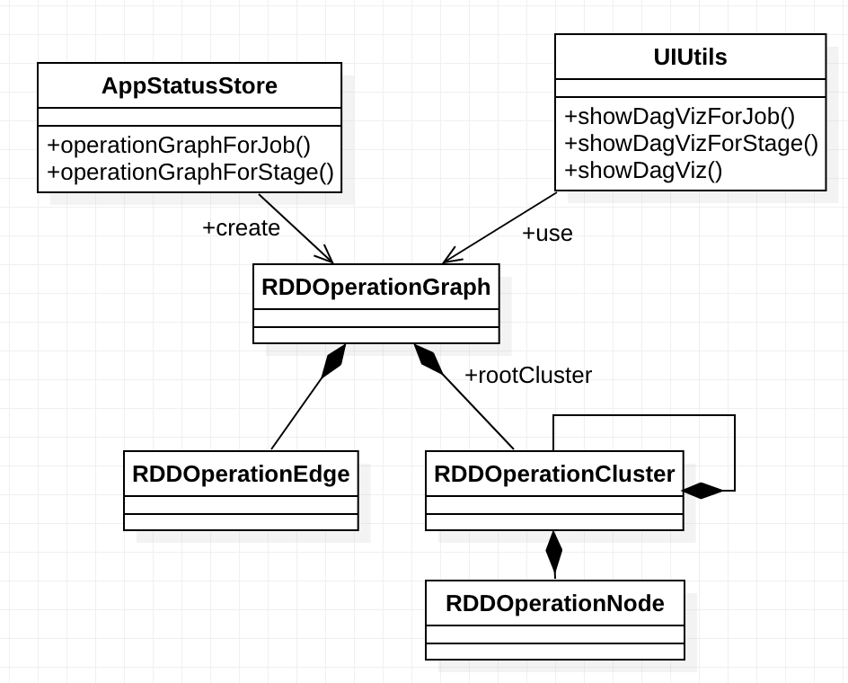

# Core WebUI

## Overview


## Design and Implementation

### WebUI Overview


### SparkUI Tabs and Pages


### RDD Operation Graph



`RDDOperationGraph` is a representation of a generic cluster graph used for storing information on
RDD operations. Each graph is defined with a set of edges and a root cluster, which may contain
children nodes and children clusters. Additionally, a graph may also have edges that enter or exit
the graph from nodes that belong to adjacent graphs.

Base on app status stored in `AppStatusStore`, `RDDOperationGraph` can be constructed, which can
then be used by `UIUtils` to do visualization (HTML/CSS/JavaScript codes).

Mapping:

| scheduler | viz | IDs |
| --- | --- | --- |
| `RDD` | `RDDOperationNode` | RDDOperationNode.id = RDD.id |
| `Dependency` | `RDDOperationEdge` | parent.id -> this.id |
| `RDDOperationScope` | `RDDOperationCluster` | RDDOperationCluster.id = RDDOperationScope.id = RDDOperationScope.nextScopeId() |
| `Stage` | `RDDOperationCluster` | stageClusterId = STAGE_CLUSTER_PREFIX + stage.stageId |


`SparkPlan.executeQuery()` invokes `RDDOperationScope.withScope(sparkContext, nodeName, ...)`.
`SparkPlan.executeQuery()` itself is invoked by

* `SparkPlan.execute()`
* `executeBroadcast[T]()`
* `CodegenSupport.produce(ctx: CodegenContext, parent: CodegenSupport)`

In such a way, a SparkPlan could be displayed as a cluster of RDDs in RDD operation graph.

### SparkPlan Graph


`SparkPlanGraph` is a graph used for storing information of an executionPlan of DataFrame. Each
graph is defined with a set of nodes and a set of edges. Each node represents a node in the
SparkPlan tree, and each edge represents a parent-child relationship between two nodes.

Base on SQL app status stored in `SQLAppStatusStore`, `SparkPlanGraph` can be constructed, which can
then be used by ExecutionPage to do visualization (HTML/CSS/JavaScript codes).

Mapping:

| planner | viz | IDs |
| --- | --- | --- |
| `SparkPlan` | `SparkPlanGraphNode` | `nodeIdGenerator.getAndIncrement()` |
| `WholeStageCodeGen` | `SparkPlanGraphCluster` | `nodeIdGenerator.getAndIncrement()` |

### Common
A `SparkPlan` is used in two ways:

* as a cluster in RDDOperationGraph since it is a RDDOperationScope.
* as a node (e.g. ProjectExec) or a cluster (e.g. WholeStageCodegenExec) SparkPlanGraph.

### DAG Visualization
`core/src/main/resources/org/apache/spark/ui/static/`

```
spark-dag-viz.js
spark-dag-viz.css
```

spark-sql-viz uses:

* graphlib-dot.min.js: data structures and algorithms for parsing dot file
* dagre-d3: layout
* d3: rendering

## Misc

### Skipped stages
* http://stackoverflow.com/questions/34580662/what-does-stage-skipped-mean-in-apache-spark-web-ui
* https://github.com/apache/spark/pull/3009
* http://blog.csdn.net/u012684933/article/details/50378725

