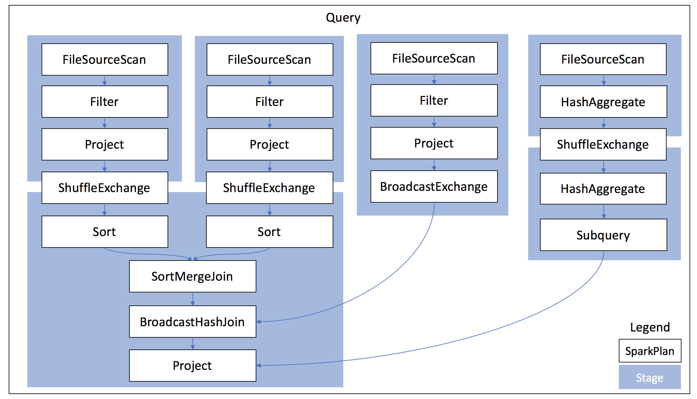

# Core WebUI

## Overview

## Design and Implementation

### WebUI Overview

### SparkUI Tabs and Pages

### RDD Operation Graph

`RDDOperationGraph` is a representation of a generic cluster graph used for storing information on
RDD operations. Each graph is defined with a set of edges and a root cluster, which may contain
children nodes and children clusters. Additionally, a graph may also have edges that enter or exit
the graph from nodes that belong to adjacent graphs.

Base on app status stored in `AppStatusStore`, `RDDOperationGraph` can be constructed, which can
then be used by `UIUtils` to do visualization (HTML/CSS/JavaScript codes).

Mapping:

| scheduler | viz | IDs |
| --- | --- | --- |
| `RDD` | `RDDOperationNode` | RDDOperationNode.id = RDD.id |
| `Dependency` | `RDDOperationEdge` | parent.id -> this.id |
| `RDDOperationScope` | `RDDOperationCluster` | RDDOperationCluster.id = RDDOperationScope.id = RDDOperationScope.nextScopeId() |
| `Stage` | `RDDOperationCluster` | stageClusterId = STAGE_CLUSTER_PREFIX + stage.stageId |

`SparkPlan.executeQuery()` invokes `RDDOperationScope.withScope(sparkContext, nodeName, ...)`.
`SparkPlan.executeQuery()` itself is invoked by

* `SparkPlan.execute()`
* `executeBroadcast[T]()`
* `CodegenSupport.produce(ctx: CodegenContext, parent: CodegenSupport)`

In such a way, a SparkPlan could be displayed as a cluster of RDDs in RDD operation graph.

### SparkPlan Graph

`SparkPlanGraph` is a graph used for storing information of an executionPlan of DataFrame. Each
graph is defined with a set of nodes and a set of edges. Each node represents a node in the
SparkPlan tree, and each edge represents a parent-child relationship between two nodes.

Base on SQL app status stored in `SQLAppStatusStore`, `SparkPlanGraph` can be constructed, which can
then be used by ExecutionPage to do visualization (HTML/CSS/JavaScript codes).

Mapping:

| planner | viz | IDs |
| --- | --- | --- |
| `SparkPlan` | `SparkPlanGraphNode` | `nodeIdGenerator.getAndIncrement()` |
| `WholeStageCodeGen` | `SparkPlanGraphCluster` | `nodeIdGenerator.getAndIncrement()` |

A `SparkPlan` is used in two ways:

* as a cluster in RDDOperationGraph since it is a RDDOperationScope.
* as a node (e.g. ProjectExec) or a cluster (e.g. WholeStageCodegenExec) SparkPlanGraph.

SparkPlan-Stage relationship in a query looks like:

Some thoughts:

* A query is split first into jobs. A broadcast operation or a scalar subquery runs as a separate job.
* A job is further split into stages at the boundary inside `ShuffleExchange`. The boundary is
  between shuffle write and shuffle read.
* `ShuffleExchange` contains two RDDs, one for shuffle write and one for shuffle read.
* `ShuffleExchange` could be reused and the stage where shuffle write exists could be skipped.
* Some queries have no jobs, e.g. `CREATE OR REPLACE TEMPORARY VIEW`
* 

## Evolution
* [SPARK-26098 Show associated SQL query in Job page](https://issues.apache.org/jira/browse/SPARK-26098)
* [SPARK-26373 Spark UI 'environment' tab - column to indicate default vs overridden values](https://issues.apache.org/jira/browse/SPARK-26373)
* [SPARK-26156 Revise summary section of stage page](https://issues.apache.org/jira/browse/SPARK-26156)

Issues:
* [SPARK-18831 SQL tab missing from UI when using ElasticSearch connector](https://issues.apache.org/jira/browse/SPARK-18831)
* [SPARK-17754 DataFrame reader and writer don't show Input/Output metrics in Spark UI](https://issues.apache.org/jira/browse/SPARK-17754)

## Misc

### Skipped stages
* http://stackoverflow.com/questions/34580662/what-does-stage-skipped-mean-in-apache-spark-web-ui
* https://github.com/apache/spark/pull/3009
* http://blog.csdn.net/u012684933/article/details/50378725

