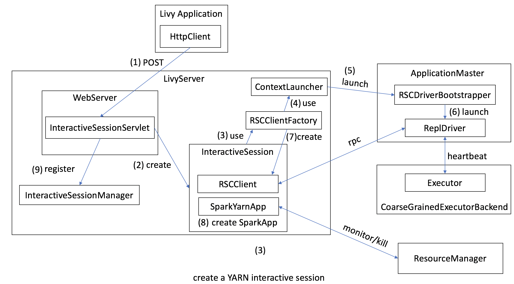

# Livy

## Overview

### Create a YARN Session

### Module Relationship

### Execute Codes

## Modules

### livy-api

### livy-client-http

### livy-server

### livy-rsc

### livy-repl

### livy-core

