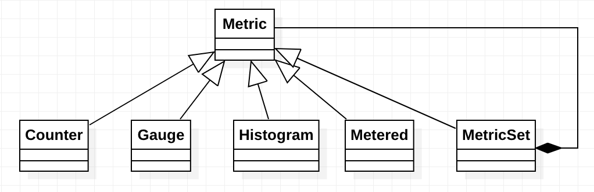

# Metrics

## Overview

## Design and Implementation

### Dropwizard Metrics

`Metric` types:

* `Counter`: An incrementing and decrementing counter metric.
* `Gauge`: A gauge metric is an instantaneous reading of a particular value.
* `Metered`: An object which maintains mean and exponentially-weighted rate.
* `Histogram`: A metric which calculates the distribution of a value.
* `MetricSet`: A set of named metrics.

### References

* https://github.com/dropwizard/metrics