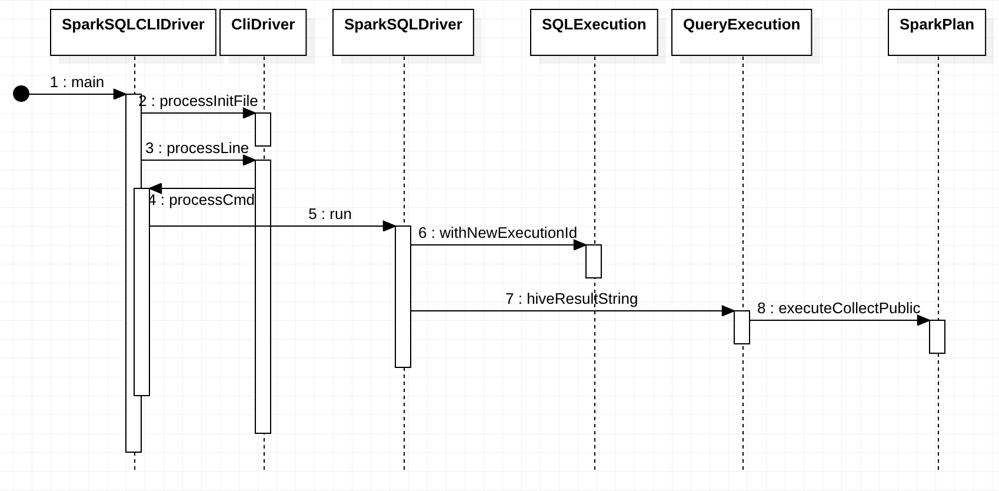

# Spark Hive Integration
## Overview

Hive serde table vs data source table, managed vs external 

http://www.gatorsmile.io/table-types-in-spark-external-or-managed/

Hive support:

https://issues.apache.org/jira/browse/SPARK-15691

Combine small files:

https://issues.apache.org/jira/browse/SPARK-14259


## Design and Implementation

### SparkSQLCLIDriver




Run:

```
spark-sql> select * from t1;
```

Thread stacktrace:

```
org.apache.spark.sql.hive.thriftserver.SparkSQLCLIDriver.processCmd(SparkSQLCLIDriver.scala:364)
org.apache.hadoop.hive.cli.CliDriver.processLine(CliDriver.java:376)
org.apache.spark.sql.hive.thriftserver.SparkSQLCLIDriver$.main(SparkSQLCLIDriver.scala:272)
org.apache.spark.sql.hive.thriftserver.SparkSQLCLIDriver.main(SparkSQLCLIDriver.scala)
sun.reflect.NativeMethodAccessorImpl.invoke0(Native Method)
sun.reflect.NativeMethodAccessorImpl.invoke(NativeMethodAccessorImpl.java:62)
sun.reflect.DelegatingMethodAccessorImpl.invoke(DelegatingMethodAccessorImpl.java:43)
java.lang.reflect.Method.invoke(Method.java:498)
org.apache.spark.deploy.JavaMainApplication.start(SparkApplication.scala:52)
org.apache.spark.deploy.SparkSubmit$.org$apache$spark$deploy$SparkSubmit$$runMain(SparkSubmit.scala:894)
org.apache.spark.deploy.SparkSubmit$.doRunMain$1(SparkSubmit.scala:198)
org.apache.spark.deploy.SparkSubmit$.submit(SparkSubmit.scala:228)
org.apache.spark.deploy.SparkSubmit$.main(SparkSubmit.scala:137)
org.apache.spark.deploy.SparkSubmit.main(SparkSubmit.scala)
```

## FQA
### what is the difference between org.spark-project.hive and org.apache.hadoop.hive

A: There are two differences:

1. We publish hive with a shaded protobuf dependency to avoid
conflicts with some Hadoop versions.
2. We publish a proper hive-exec jar that only includes hive packages.
The upstream version of hive-exec bundles a bunch of other random
dependencies in it which makes it really hard for third-party projects
to use it.

http://mail-archives.apache.org/mod_mbox/spark-dev/201407.mbox/%3CCABPQxsshySgdp-SyEmPZ=PJ8092rEuQ0voxyYVuA7JGDEc6pSQ@mail.gmail.com%3E

https://github.com/JoshRosen/hive/commits/release-1.2.1-spark2

### spark.sql.warehouse.dir

```
Note that the hive.metastore.warehouse.dir property in hive-site.xml is deprecated since Spark 2.0.0. Instead, use spark.sql.warehouse.dir to specify the default location of database in warehouse. You may need to grant write privilege to the user who starts the Spark application.
```

https://stackoverflow.com/questions/45819568/why-there-are-many-spark-warehouse-folders-got-created
