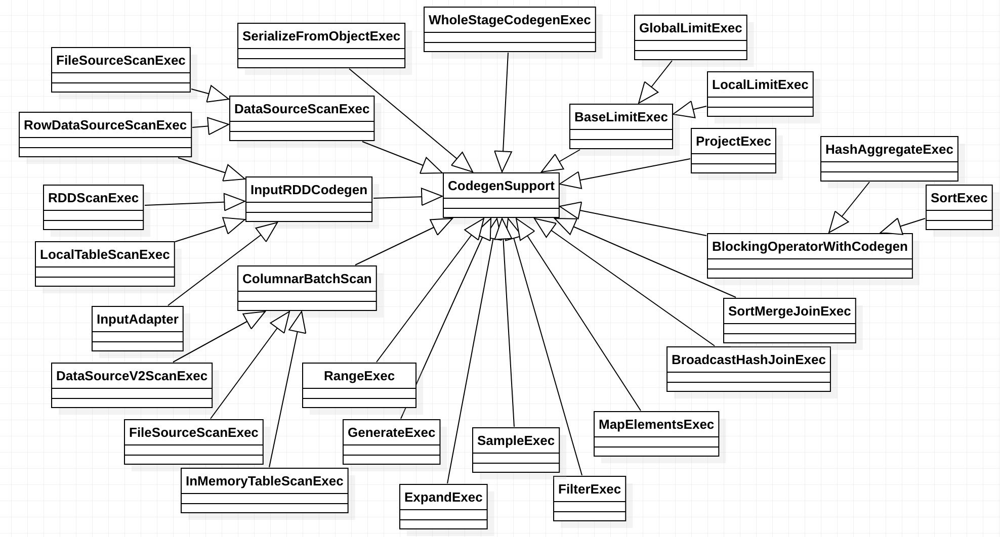

# Whole Stage Codegen

## Overview


## Design and Implementation



Several special `CodegenSupport`

* `WholeStageCodegenExec`. WholeStageCodegen compiles a subtree of plans that support codegen
  together into single Java function.
* `BlockingOperatorWithCodegen`. A special kind of operators which support whole stage codegen.
  Blocking means these operators will consume all the inputs first, before producing output. Typical
  blocking operators are sort and aggregate.
* `InputAdapter`. InputAdapter is used to hide a SparkPlan from a subtree that supports codegen.
  This is the leaf node of a tree with WholeStageCodegen that is used to generate code that consumes
  an RDD iterator of InternalRow. 

## Configuration

* spark.sql.codegen.wholeStage true
* spark.sql.codegen.useIdInClassName true
* spark.sql.codegen.maxFields 100
* spark.sql.codegen.factoryMode (for test only)
* spark.sql.codegen.fallback true
* spark.sql.codegen.logging.maxLines 1000

e.g.

```
/* 1000 */             project_inTmpResult_19 = -1; // project_isNull_172 = true;
/* 1001 */             [truncated to 1000 lines (total lines is 31751)]
```

* spark.sql.codegen.hugeMethodLimit 65535
* spark.sql.codegen.splitConsumeFuncByOperator true

## Evolution

* Decouple the generated codes of consuming rows in operators under whole-stage codegen.
https://issues.apache.org/jira/browse/SPARK-21717
* "distribute by" on multiple columns may lead to codegen issue.
https://issues.apache.org/jira/browse/SPARK-25084
* SPIP: Structured Intermediate Representation (Tungsten IR) for generating Java code.
https://issues.apache.org/jira/browse/SPARK-25728


## References
* https://jaceklaskowski.gitbooks.io/mastering-spark-sql/spark-sql-whole-stage-codegen.html
